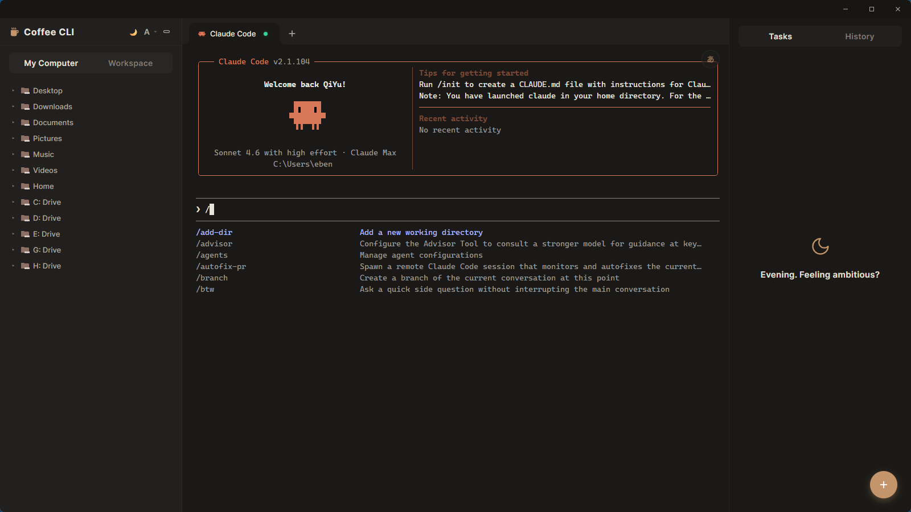
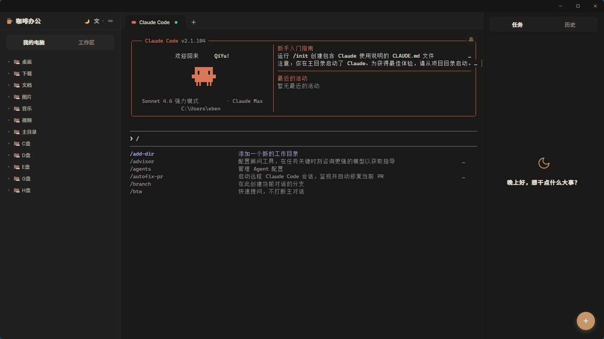
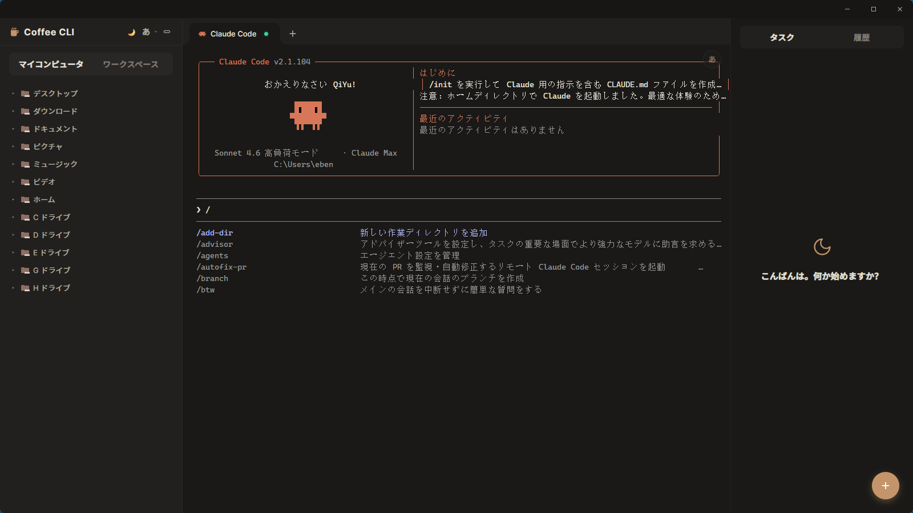
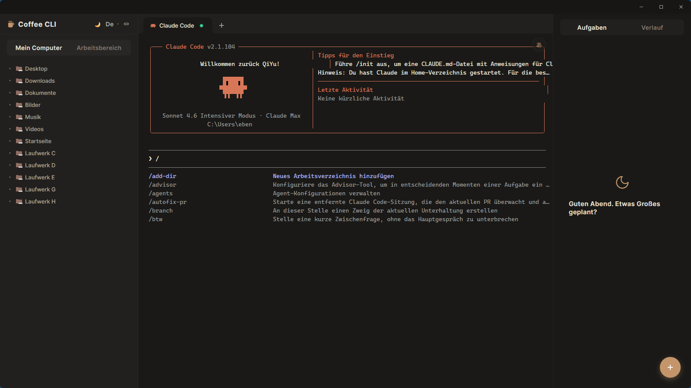
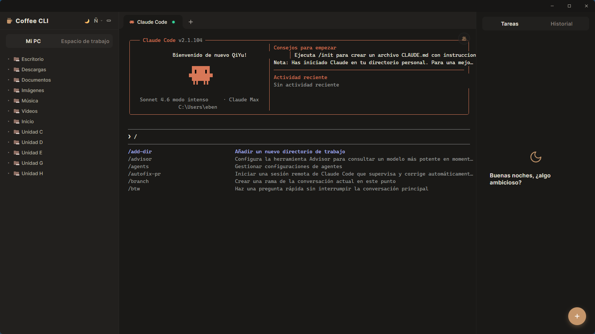
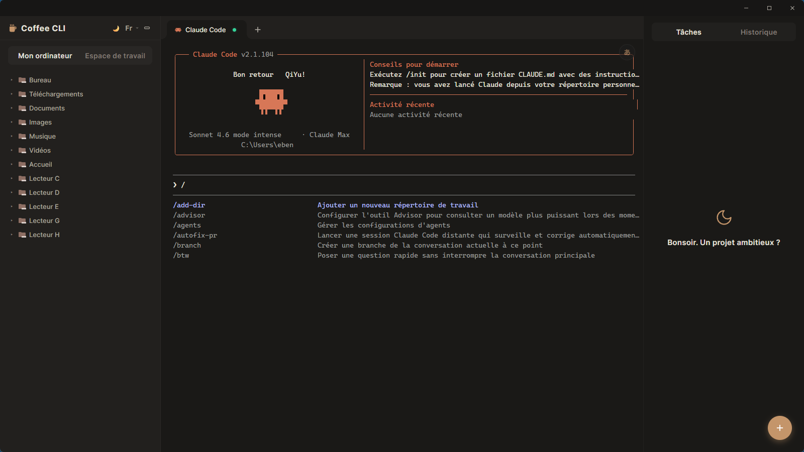
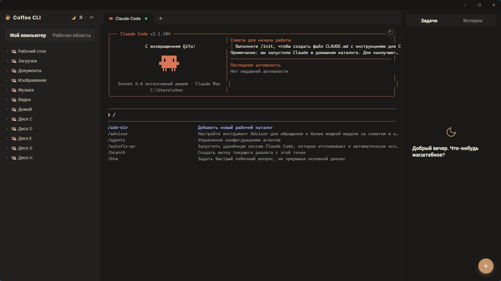

<p align="center">
  
</p>

<h1 align="center">Coffee CLI</h1>

<p align="center">
  <strong>The world's first native GUI companion for AI CLI Agents — in your language.</strong>
</p>

<p align="center">
  <a href="#english">English</a> ·
  <a href="#简体中文">简体中文</a> ·
  <a href="#繁體中文">繁體中文</a> ·
  <a href="#deutsch">Deutsch</a> ·
  <a href="#español">Español</a> ·
  <a href="#français">Français</a> ·
  <a href="#日本語">日本語</a> ·
  <a href="#한국어">한국어</a> ·
  <a href="#português">Português</a> ·
  <a href="#русский">Русский</a>
</p>

<p align="center">
  
  
  
  
</p>

---

## English

### What is Coffee CLI?

Coffee CLI is a **native desktop companion** for AI CLI agents — Claude Code, OpenAI Codex, and more. It wraps your terminal in a full GUI experience and does something no other tool does: **it translates the entire CLI agent interface into your native language, in real time**.

This is not a web app. Not an Electron wrapper. A **true native desktop app** built with Tauri (Rust core), engineered for performance and low resource usage.

### Who is it for?

AI coding agents are transforming how work gets done — but they speak English, output dense terminal text, and assume you're comfortable with a command line. That leaves out a massive group of capable, intelligent professionals:

- **Business executives** who want AI to accelerate decisions and automate operations
- **Designers and creatives** who want to build and automate without learning bash
- **Product managers** who want to run agents against their own products
- **Researchers, analysts, consultants** — any domain expert who isn't a developer

Coffee CLI removes both barriers at once: **no terminal expertise required, no English required**.

### Key Features

#### Real-Time Terminal Translation
The headline feature. Coffee CLI intercepts and translates CLI agent output — commands, responses, error messages, progress indicators — into your chosen language as it streams. You see the agent working *in your language*.

10 languages supported out of the box:

| Language | Code |
|---|---|
| English | `en` |
| 简体中文 | `zh-CN` |
| 繁體中文 | `zh-TW` |
| Deutsch | `de` |
| Español | `es` |
| Français | `fr` |
| 日本語 | `ja` |
| 한국어 | `ko` |
| Português | `pt` |
| Русский | `ru` |

#### Multi-Tab Sessions
Run multiple agent sessions side by side. Each tab is independent — its own process, its own translation context, its own history.

#### Session History
Every conversation with Claude Code, Codex, or any CLI agent is automatically saved and searchable. Resume any past session from where you left off.

#### Built-In File Explorer
Navigate your workspace without leaving the app. Copy file paths, drag references directly into your agent prompt.

#### Task Board
Keep track of what you've asked the agent to do. Organize tasks, add notes, mark progress — all in the sidebar while the agent works.

#### Agent Installer
One-click installation of popular AI CLI agents (Claude Code, Codex, and more) directly from the app. No terminal required.

#### Remote Terminal
Connect to remote machines over SSH. Run agents on servers without leaving Coffee CLI.

### Screenshots

<table>
  <tr>
    <td align="center"><b>English</b><br/></td>
    <td align="center"><b>简体中文</b><br/></td>
  </tr>
  <tr>
    <td align="center"><b>繁體中文</b><br/></td>
    <td align="center"><b>日本語</b><br/></td>
  </tr>
  <tr>
    <td align="center"><b>한국어</b><br/></td>
    <td align="center"><b>Deutsch</b><br/></td>
  </tr>
  <tr>
    <td align="center"><b>Español</b><br/></td>
    <td align="center"><b>Français</b><br/></td>
  </tr>
  <tr>
    <td align="center"><b>Português</b><br/></td>
    <td align="center"><b>Русский</b><br/></td>
  </tr>
</table>

### Install

**Windows**
```powershell
irm https://raw.githubusercontent.com/edison7009/Coffee-CLI/main/install/install.ps1 | iex
```

**macOS** (Apple Silicon & Intel)
```bash
curl -fsSL https://raw.githubusercontent.com/edison7009/Coffee-CLI/main/install/install.sh | sh
```

**Linux** (Debian / Ubuntu / AppImage)
```bash
curl -fsSL https://raw.githubusercontent.com/edison7009/Coffee-CLI/main/install/install.sh | sh
```

Or download directly from [Releases](https://github.com/edison7009/Coffee-CLI/releases).

| Platform | Installer |
|---|---|
| Windows x64 | `.exe` setup |
| macOS Apple Silicon | `.dmg` |
| macOS Intel | `.dmg` |
| Linux Debian/Ubuntu | `.deb` |
| Linux universal | `.AppImage` |

### Build from Source

```bash
# Prerequisites: Rust, Node.js
git clone https://github.com/edison7009/Coffee-CLI
cd Coffee-CLI
cd src-ui && npm install && cd ..
cargo tauri build
```

---

## 简体中文

### Coffee CLI 是什么？

Coffee CLI 是专为 AI CLI Agent 打造的**原生桌面伴侣应用**，支持 Claude Code、OpenAI Codex 等主流 Agent。它将终端包装进完整的图形界面，并实现了其他任何工具都没有的功能：**将整个 CLI Agent 界面实时翻译成你的母语**。

这不是网页应用，不是 Electron 壳，而是基于 Tauri（Rust 内核）构建的**真正原生桌面应用**，性能优异，资源占用极低。

### 为谁而生？

AI 编程 Agent 正在改变工作方式——但它们说英语、输出密集的终端文本，默认你熟悉命令行。这将大量有能力、有智识的专业人士拒之门外：

- **企业高管**：想用 AI 加速决策、自动化业务流程
- **设计师与创意人**：想构建和自动化，但不想学 bash
- **产品经理**：想直接对自己的产品跑 Agent
- **研究员、分析师、顾问**：各行各业的领域专家，不是开发者

Coffee CLI 同时消除两道门槛：**不需要终端经验，不需要懂英语**。

### 核心功能

#### 实时终端翻译
最核心的功能。Coffee CLI 拦截并翻译 CLI Agent 的全部输出——命令、响应、错误信息、进度提示——在内容流式输出的同时翻译成你选择的语言。你看到的是 Agent 在**用你的语言**工作。

原生支持 10 种语言，开箱即用。

#### 多 Tab 会话
同时运行多个 Agent 会话。每个 Tab 独立——独立进程、独立翻译上下文、独立历史记录。

#### 会话历史
与 Claude Code、Codex 或任何 CLI Agent 的每次对话都会自动保存，可搜索。随时从上次的地方继续。

#### 内置文件浏览器
无需离开应用即可浏览工作区。复制文件路径，直接将引用拖入 Agent 提示词。

#### 任务板
追踪你要求 Agent 完成的任务。整理任务、添加备注、标记进度——Agent 工作时，一切都在侧边栏。

#### Agent 安装器
一键安装主流 AI CLI Agent（Claude Code、Codex 等），无需打开终端。

#### 远程终端
通过 SSH 连接远程机器，在服务器上运行 Agent，无需离开 Coffee CLI。

### 安装

**Windows**
```powershell
irm https://raw.githubusercontent.com/edison7009/Coffee-CLI/main/install/install.ps1 | iex
```

**macOS**（Apple Silicon 和 Intel 均支持）
```bash
curl -fsSL https://raw.githubusercontent.com/edison7009/Coffee-CLI/main/install/install.sh | sh
```

**Linux**（Debian / Ubuntu / AppImage）
```bash
curl -fsSL https://raw.githubusercontent.com/edison7009/Coffee-CLI/main/install/install.sh | sh
```

也可以直接从 [Releases](https://github.com/edison7009/Coffee-CLI/releases) 下载对应平台的安装包。

---

## 繁體中文

### Coffee CLI 是什麼？

Coffee CLI 是專為 AI CLI Agent 打造的**原生桌面伴侶應用**，支援 Claude Code、OpenAI Codex 等主流 Agent。它將終端包裝進完整的圖形介面，並實現了其他任何工具都沒有的功能：**將整個 CLI Agent 介面即時翻譯成你的母語**。

這不是網頁應用，不是 Electron 殼，而是基於 Tauri（Rust 核心）構建的**真正原生桌面應用**，效能優異，資源佔用極低。

### 為誰而生？

AI 編程 Agent 正在改變工作方式——但它們說英語、輸出密集的終端文字，預設你熟悉命令列。這將大量有能力、有智識的專業人士拒之門外：

- **企業高管**：想用 AI 加速決策、自動化業務流程
- **設計師與創意人**：想構建和自動化，但不想學 bash
- **產品經理**：想直接對自己的產品跑 Agent
- **研究員、分析師、顧問**：各行各業的領域專家，不是開發者

Coffee CLI 同時消除兩道門檻：**不需要終端經驗，不需要懂英語**。

### 核心功能

#### 即時終端翻譯
最核心的功能。Coffee CLI 攔截並翻譯 CLI Agent 的全部輸出——命令、回應、錯誤訊息、進度提示——在內容串流輸出的同時翻譯成你選擇的語言。

原生支援 10 種語言，開箱即用。多 Tab 會話、會話歷史、內建檔案瀏覽器、任務板、Agent 安裝器、遠端終端——一應俱全。

---

## Deutsch

### Was ist Coffee CLI?

Coffee CLI ist eine **native Desktop-Begleit-App** für KI-CLI-Agenten — Claude Code, OpenAI Codex und mehr. Es bettet Ihr Terminal in eine vollständige GUI ein und tut etwas, das kein anderes Tool leistet: Es **übersetzt die gesamte CLI-Agent-Oberfläche in Ihre Muttersprache, in Echtzeit**.

Keine Web-App. Kein Electron-Wrapper. Eine **echte native Desktop-Anwendung**, gebaut mit Tauri (Rust-Kern).

### Für wen ist es gedacht?

KI-Coding-Agenten verändern die Arbeitswelt — aber sie sprechen Englisch, geben dichte Terminal-Texte aus und setzen Kenntnisse der Kommandozeile voraus. Coffee CLI beseitigt beide Hürden gleichzeitig: **Keine Terminal-Kenntnisse erforderlich, kein Englisch erforderlich.**

**Hauptfunktionen:** Echtzeit-Terminal-Übersetzung · Multi-Tab-Sitzungen · Sitzungsverlauf · Datei-Explorer · Aufgaben-Board · Agent-Installer · Remote-Terminal

10 Sprachen werden nativ unterstützt.

---

## Español

### ¿Qué es Coffee CLI?

Coffee CLI es una **aplicación de escritorio nativa** diseñada para agentes de IA en CLI — Claude Code, OpenAI Codex y más. Envuelve tu terminal en una interfaz gráfica completa y hace algo que ninguna otra herramienta hace: **traduce toda la interfaz del agente CLI a tu idioma nativo, en tiempo real**.

No es una aplicación web. No es un envoltorio de Electron. Es una **aplicación de escritorio nativa real**, construida con Tauri (núcleo en Rust).

### ¿Para quién es?

Los agentes de IA están transformando el trabajo — pero hablan inglés, generan texto de terminal denso y asumen que dominas la línea de comandos. Coffee CLI elimina ambas barreras a la vez: **sin necesidad de experiencia en terminal, sin necesidad de saber inglés.**

**Funciones principales:** Traducción de terminal en tiempo real · Sesiones multi-pestaña · Historial de sesiones · Explorador de archivos · Tablero de tareas · Instalador de agentes · Terminal remota

10 idiomas compatibles de serie.

---

## Français

### Qu'est-ce que Coffee CLI ?

Coffee CLI est une **application de bureau native** conçue pour les agents IA en ligne de commande — Claude Code, OpenAI Codex et autres. Elle enveloppe votre terminal dans une interface graphique complète et fait quelque chose qu'aucun autre outil ne fait : **elle traduit toute l'interface de l'agent CLI dans votre langue maternelle, en temps réel**.

Ce n'est pas une application web. Pas un wrapper Electron. Une **vraie application de bureau native**, construite avec Tauri (cœur Rust).

### Pour qui ?

Les agents IA transforment le travail — mais ils parlent anglais, produisent du texte de terminal dense et supposent une maîtrise de la ligne de commande. Coffee CLI supprime les deux barrières à la fois : **aucune expertise terminal requise, aucune connaissance de l'anglais requise.**

**Fonctionnalités clés :** Traduction de terminal en temps réel · Sessions multi-onglets · Historique des sessions · Explorateur de fichiers · Tableau de tâches · Installeur d'agents · Terminal distant

10 langues prises en charge nativement.

---

## 日本語

### Coffee CLI とは？

Coffee CLI は、AI CLI エージェント（Claude Code、OpenAI Codex など）向けに作られた**ネイティブデスクトップコンパニオンアプリ**です。ターミナルを完全な GUI でラップし、他のどのツールも実現していない機能を提供します：**CLI エージェントのインターフェース全体をリアルタイムであなたの母国語に翻訳する**機能です。

ウェブアプリでも Electron ラッパーでもありません。Tauri（Rust コア）で構築された**真のネイティブデスクトップアプリ**です。

### 誰のためのツール？

AI コーディングエージェントは働き方を変えつつあります——しかし、英語で動作し、密度の高いターミナルテキストを出力し、コマンドラインの習熟を前提としています。Coffee CLI はその2つのハードルを同時に取り除きます：**ターミナルの知識不要、英語不要**。

**主な機能：** リアルタイム翻訳 · マルチタブセッション · セッション履歴 · ファイルエクスプローラー · タスクボード · エージェントインストーラー · リモートターミナル

10言語をネイティブサポート。

---

## 한국어

### Coffee CLI란?

Coffee CLI는 AI CLI 에이전트(Claude Code, OpenAI Codex 등)를 위한 **네이티브 데스크톱 컴패니언 앱**입니다. 터미널을 완전한 GUI로 감싸고, 다른 어떤 도구도 하지 못하는 기능을 제공합니다: **CLI 에이전트 인터페이스 전체를 실시간으로 모국어로 번역**합니다.

웹 앱도 아니고 Electron 래퍼도 아닙니다. Tauri(Rust 코어)로 구축된 **진정한 네이티브 데스크톱 앱**입니다.

### 누구를 위한 도구인가?

AI 코딩 에이전트는 일하는 방식을 바꾸고 있습니다——하지만 영어로 동작하고, 빽빽한 터미널 텍스트를 출력하며, 커맨드라인 숙련도를 전제합니다. Coffee CLI는 두 가지 장벽을 동시에 제거합니다: **터미널 지식 불필요, 영어 불필요**.

**주요 기능:** 실시간 번역 · 멀티탭 세션 · 세션 히스토리 · 파일 탐색기 · 작업 보드 · 에이전트 설치 관리자 · 원격 터미널

10개 언어 기본 지원.

---

## Português

### O que é o Coffee CLI?

Coffee CLI é um **aplicativo de desktop nativo** projetado para agentes de IA em CLI — Claude Code, OpenAI Codex e outros. Ele envolve seu terminal em uma interface gráfica completa e faz algo que nenhuma outra ferramenta faz: **traduz toda a interface do agente CLI para seu idioma nativo, em tempo real**.

Não é um aplicativo web. Não é um wrapper Electron. É um **verdadeiro aplicativo de desktop nativo**, construído com Tauri (núcleo em Rust).

### Para quem é?

Os agentes de IA estão transformando o trabalho — mas falam inglês, geram texto de terminal denso e assumem familiaridade com a linha de comando. Coffee CLI elimina as duas barreiras ao mesmo tempo: **sem necessidade de experiência em terminal, sem necessidade de saber inglês.**

**Recursos principais:** Tradução de terminal em tempo real · Sessões multi-aba · Histórico de sessões · Explorador de arquivos · Quadro de tarefas · Instalador de agentes · Terminal remoto

10 idiomas suportados nativamente.

---

## Русский

### Что такое Coffee CLI?

Coffee CLI — это **нативное десктопное приложение-компаньон** для ИИ-агентов в CLI — Claude Code, OpenAI Codex и других. Оно оборачивает терминал в полноценный графический интерфейс и делает то, чего не умеет ни один другой инструмент: **переводит весь интерфейс CLI-агента на ваш родной язык в реальном времени**.

Это не веб-приложение. Не обёртка на Electron. Настоящее **нативное десктопное приложение**, построенное на Tauri (ядро на Rust).

### Для кого это?

ИИ-агенты меняют способы работы — но они говорят по-английски, выводят плотный терминальный текст и предполагают знание командной строки. Coffee CLI устраняет оба барьера одновременно: **не нужно знать терминал, не нужно знать английский**.

**Ключевые функции:** Перевод терминала в реальном времени · Мультивкладочные сессии · История сессий · Файловый проводник · Доска задач · Установщик агентов · Удалённый терминал

10 языков поддерживается нативно.

---

## License

MIT © [edison7009](https://github.com/edison7009)
